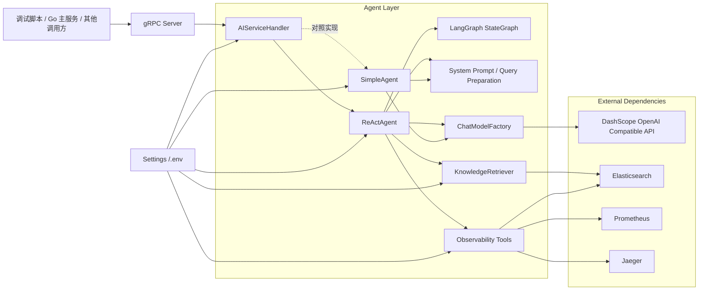
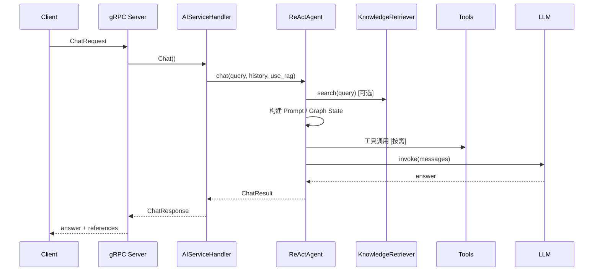
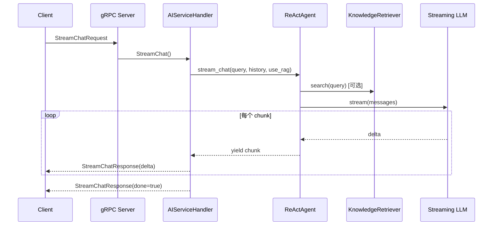

# Keep-AI 架构设计与技术选型

> **项目状态：MVP 版本**
>
> 当前 `Keep-AI` 偏向“Python 版 AI 核心服务 MVP”，优先打通主链路，再逐步补 Prompt 优化、记忆系统、缓存与更完整的工程化能力。

## 项目定位

`Keep-AI` 是一个基于 `Python3 + gRPC + LangChain/LangGraph + Elasticsearch` 的 AI 运维助手服务。

它当前承担的职责是：

- 作为独立的 AI 推理与工具编排服务
- 通过 gRPC 对外暴露 `Chat` / `StreamChat`
- 负责大模型调用、RAG 检索、工具调用和回答生成
- 为后续 Go 主服务接入提供 AI 能力层

## 目录结构

```text
keep-ai/
├── agent/                  # 智能体编排层
│   ├── react_agent.py      # ReAct Agent + LangGraph 主链路
│   └── simple_agent.py     # 直接调用 LLM 的简化对照版
├── clients/                # 基础客户端封装
│   └── elasticsearch_client.py
├── config/                 # 配置管理
│   └── settings.py
├── debug/                  # 调试脚本
│   ├── debug_client.py
│   └── debug_stream_client.py
├── embedding/              # Embedding 封装
│   └── embedder.py
├── models/                 # LLM 模型工厂
│   └── chat_model.py
├── prompts/                # Prompt 模板
│   └── system_prompt.py
├── retriever/              # RAG 检索层
│   └── knowledge_retriever.py
├── rpc/                    # gRPC 服务层
│   ├── gen/                # proto 生成代码
│   ├── handlers.py         # Chat / StreamChat 处理器
│   └── server.py           # gRPC 服务启动与优雅关闭
├── schemas/                # 数据模型
│   ├── chat.py
│   └── knowledge.py
├── tools/                  # Tool Calling 能力
│   └── observability_tools.py
├── .env                    # 本地环境变量
├── main.py                 # 启动入口
├── pyproject.toml          # 依赖与项目元数据
└── uv.lock                 # 依赖锁文件
```

## 整体架构图



## 核心链路

### 同步聊天链路



### 流式聊天链路



## 模块职责

### `config/`

- `settings.py`
- 基于 `pydantic-settings` 从 `.env` 读取配置
- 提供 gRPC、LLM、Embedding、ES、Prometheus、Jaeger、Redis 等统一配置入口

### `models/`

- `chat_model.py`
- 封装主模型与快速模型
- 当前通过 `langchain-openai` 对接 DashScope OpenAI Compatible API
- 已支持 `streaming=True/False`

### `embedding/`

- `embedder.py`
- 负责文本向量化
- 当前使用 `OpenAIEmbeddings`
- 主要用于 RAG 检索链路

### `retriever/`

- `knowledge_retriever.py`
- 负责：
  - 确保知识索引存在
  - 文档入库
  - 混合检索
- 当前检索策略：
  - `dense_vector` 语义相似度
  - `multi_match` 关键词召回

### `tools/`

- `observability_tools.py`
- 封装可被 Agent 调用的工具：
  - `get_current_time`
  - `search_knowledge`
  - `query_metrics`
  - `query_logs`
  - `query_traces`
- 这些工具通过 `@tool` 注册给 ReAct Agent

### `agent/`

#### `react_agent.py`

- 当前主链路
- 负责：
  - 历史消息裁剪
  - RAG 检索
  - 构建 Prompt 上下文
  - 调用 ReAct Agent
  - 返回同步/流式答案
- 当前通过 `LangGraph StateGraph` 编排：
  - `InputToRag`
  - `KnowledgeRetriever`
  - `InputToChat`
  - `ChatTemplate`
  - `ReactAgent`

#### `simple_agent.py`

- 对照版实现
- 不做工具调用、不做图编排
- 直接拼装消息并调用 LLM
- 适合做最小化验证与回归对照

### `rpc/`

#### `handlers.py`

- gRPC 入口处理器
- 负责：
  - 把 proto request 转成内部 schema
  - 调用 `ReActAgent`
  - 把结果再转回 proto response
  - 记录请求级日志

#### `server.py`

- gRPC 服务启动入口
- 已实现：
  - 端口绑定检查
  - `SIGINT` / `SIGTERM` 优雅关闭
  - `server.stop(grace=5)`
  - 清理阶段日志

### `debug/`

- 存放独立调试脚本，不污染业务代码
- 当前已有：
  - `debug_client.py`
  - `debug_stream_client.py`

***

## 技术选型

### 语言与运行时

- `Python 3.14`
- 理由：
  - AI 生态成熟
  - LangChain/LangGraph 适配度高
  - 开发效率高，适合快速实现 AI 服务层

### 依赖管理

- `uv`
- 理由：
  - 初始化、安装、锁定依赖速度快
  - 比传统 `pip + venv` 更现代
  - 适合个人项目和 AI 服务开发

### 通信协议

- `gRPC`
- 理由：
  - 类型明确
  - 很适合作为 Go 与 Python 的服务间调用协议
  - 支持 `Chat` 和 `StreamChat`

### 模型接入

- `langchain-openai`
- 实际接入目标：`DashScope OpenAI Compatible API`
- 理由：
  - 使用统一 OpenAI 风格接口
  - 支持普通与流式模型调用

### Agent 编排

- `LangChain create_agent`
- `LangGraph StateGraph`
- 理由：
  - 对应 ReAct + Graph 编排思路
  - 便于把 RAG、工具调用和 Prompt 组织成图

### 向量检索

- `Elasticsearch 8.x`
- 理由：
  - 同时承载向量检索和日志检索
  - 当前使用 `dense_vector + multi_match` 做 Hybrid Search

### 配置管理

- `pydantic-settings`
- 理由：
  - `.env` 到强类型对象的映射清晰
  - 配置校验方便
  - 适合中小型 Python 服务

### 工具系统

- `langchain_core.tools.tool`
- 理由：
  - 工具声明方式直观
  - 便于挂到 Agent
  - 可扩展性好

### 调试策略

- `debug/` 独立调试脚本
- 理由：
  - 不污染业务层
  - 适合先验证 gRPC，再接 Go 主服务

## 待办事项

### 已实现

- gRPC 服务启动与优雅关闭
- `Chat` / `StreamChat`
- LLM 模型封装
- Embedding 封装
- Elasticsearch 混合检索
- ReAct Agent 基础链路
- Observability 工具集
- 调试脚本

### 尚未完成

- `PromptOptimizer`
- Prompt 优化配置开关
- 基于 Redis 的 Prompt 缓存
- 更完整的短期 / 长期记忆体系
- 用户画像
- 更细粒度的输出约束模板体系
- 更成熟的 Prompt 个性化与角色增强

## 当前已知缺口

### Prompt 优化层缺失

当前只有静态 `SYSTEM_PROMPT`，没有课件里的 `PromptOptimizer` 层。

直接影响：

- 无法动态叠加角色定义
- 无法统一添加上下文增强
- 无法统一注入输出格式要求
- 无法做 Prompt 缓存

### 记忆系统尚未接入主链路

虽然配置里已经预留了 Redis，但当前主链路还没有真正使用：

- Redis 短期记忆
- MySQL 长期记忆
- 用户画像

### 流式体验仍可继续优化

当前已经可正常流式输出，但从终端观感看，仍可继续改进：

- 更细粒度 chunk 拆分
- 调试端 typewriter 展示
- 将最终回答阶段改为更细粒度的裸 LLM stream

### 工程化仍有提升空间

- 请求超时策略可继续细化
- 更完整的 tracing / metrics 接入
- 配置项可继续分层
- 各类资源清理可继续标准化

## 推荐演进路线

### 第一阶段：补齐 Prompt 层

目标：

- 新增 `prompts/optimizer.py`
- 在 `settings.py` 增加 `prompt_optimization_enabled`
- 在 `ReActAgent` / `SimpleAgent` 接入动态 Prompt 优化

### 第二阶段：补齐缓存与记忆

目标：

- 给 Prompt 优化器接入 Redis 缓存
- 给会话接入 Redis 短期记忆
- 预留 MySQL 长期历史接口

### 第三阶段：补齐可观测性与生产化

目标：

- 更完整的请求级日志
- gRPC 超时、重试、限流
- 更明确的错误码与降级策略

### 第四阶段：接入 Go 主服务

目标：

- 由 Go 服务通过 gRPC 调用 `keep-ai`
- Go 负责 API 网关 / SSE / 业务编排
- Python 负责 AI 核心服务

***

## 当前待办建议

建议优先级如下：

1. 实现 Python 版 `PromptOptimizer`
2. 在 `settings.py` 补齐 Prompt 优化配置项
3. 在 `ReActAgent` / `SimpleAgent` 接入 Prompt 优化层
4. 为 Prompt 优化增加 Redis 缓存
5. 优化流式 chunk 粒度与终端展示体验
6. 接入 Redis 短期记忆
7. 规划 MySQL 长期记忆与历史会话
8. 为 Go 主服务准备 gRPC 客户端对接文档

